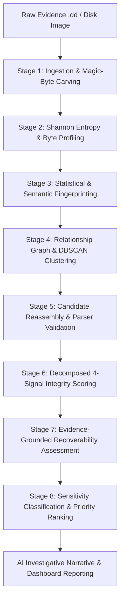

# 🔍 RECOV: Autonomous Forensic Recovery & Intelligence Engine

<div align="center">


**An intelligent, local-first digital forensics, fragment reassembly, and AI-powered investigative intelligence system.**

[Key Features](#-key-features) • [Architecture](#-pipeline-architecture) • [Archive Recovery](#-archive-recovery-engine) • [Scoring & Integrity](#-decomposed-4-signal-integrity-scoring) • [Getting Started](#-getting-started) • [AI Narrative](#-ai-investigative-narrative) • [Benchmarks](#-evaluation--benchmarks)

</div>

---

## 📖 Executive Summary

**RECOV** is a state-of-the-art forensic reconstruction and evidence intelligence engine engineered to analyze raw disk images (`.dd`, raw byte streams, and unallocated cluster dumps). When storage media undergoes fragmentation, partial file deletion, filesystem corruption, or deliberate data tampering, standard recovery utilities fail because contiguous metadata is lost.

RECOV bridges this gap by combining **format-aware byte carving**, **Shannon entropy profiling**, **semantic & statistical n-gram fingerprinting**, **graph-theoretic clustering**, **bounded beam-search reassembly**, **real-parser structural validation**, **sensitive PII classification**, and **generative AI narrative reporting** into an end-to-end, 8-stage deterministic pipeline.

---

## 🌟 Key Features

| Capability | Description |
| :--- | :--- |
| **Raw Disk Carving** | Header/body/trailer identification across compound documents (`PDF`, `DOCX`), archives (`ZIP`, `TAR`, `7Z`, `GZ`, `BZ2`, `RAR`, `WIM`), databases (`SQLite`), images (`JPEG`, `PNG`), and text/logs. |
| **Entropy & Characterization** | Sliding-window Shannon entropy calculations, byte frequency distribution analysis, and structural classification (Plaintext, Compressed, Encrypted, Executable, Structured Binary). |
| **Dual-Layer Fingerprinting** | Hybrid statistical byte-level n-gram distribution combined with TF-IDF and optional 384-dimensional dense semantic embeddings (`sentence-transformers` / `all-MiniLM-L6-v2`). |
| **Relationship Graph & Clustering** | Dynamic spatial-temporal graph construction constrained by header-body-trailer order, physical offset proximity, and DBSCAN density clustering. |
| **Multi-Level Reassembly (L1–L5)** | Handles sequential (`L1`), non-sequential via beam search (`L2`), nested (`L4`), and braided/interleaved (`L5`) fragment reassembly without factorial combinatorial explosion. |
| **Real Parser Verification** | Structural validation using battle-tested parsers (`Pillow`, `pypdf`, `python-docx`, `sqlite3`, `zipfile`, `tarfile`, `gzip`, `bz2`, `7z`/`rar` headers) rather than superficial magic-number matching. |
| **Decomposed 4-Signal Integrity** | Eliminates ambiguous "confidence scores" by isolating Relationship Confidence, Completeness Ratio, Structural Parser Validity, and Corruption Rate. |
| **PII & Sensitivity Auditing** | Identifies Indian Aadhaar (with **Verhoeff algorithm** checksum validation), PAN cards, credit cards, emails, phone numbers, and financial/confidential keywords. |
| **Multi-Provider AI Narrative** | Generates court-ready, structured investigative summaries using Google Gemini, Anthropic Claude, OpenAI GPT-4o, Ollama (local Llama 3), Groq, OpenRouter, or an offline rule-based engine. |
| **Forensics Dashboard** | Streamlit-based UI equipped with live execution tracking, interactive hex viewer, relationship network graphs, priority queues, and report exports (JSON & Markdown). |

---

## 🏗️ Architectural Tenets

1. **Local-First Execution**: Complete pipeline operates locally on analyst hardware without mandatory cloud connections, maintaining strict chain of custody and data privacy.
2. **Strict Evaluation Isolation**: Production carving, clustering, and recovery modules **never** inspect or import `ground_truth.json`. Evaluation metrics remain strictly isolated in `evaluation/`.
3. **Zero Fabricated Metrics**: No unproven 100% guarantees or fabricated courtroom claims. Every file state is verified against concrete parser errors, CRC checksums, and byte gap counts.
4. **Bounded Deterministic Search**: Non-sequential reassembly utilizes bounded beam search (width $\le 8$, depth $\le 12$) pruned by format syntax to ensure fast, reproducible results.

---

## 🔄 Pipeline Architecture

RECOV processes evidence through 8 deterministic stages:



### Stage Breakdown

```
Stage 1: Evidence Ingestion & Carving
  ├── SHA-256 evidence integrity hashing (Chain of Custody)
  └── Magic-byte scanning for headers, body chunks, and trailers
Stage 2: Fragment Characterization
  ├── Shannon entropy (0.0 to 8.0 bits/byte)
  └── Sliding-window transition detection (Text vs. Binary vs. Compressed)
Stage 3: Statistical & Semantic Fingerprinting
  ├── 256-bin normalized byte frequency histograms
  ├── Character n-grams (unigrams, bigrams, trigrams) & TF-IDF
  └── 384-dimensional dense semantic embedding vectors
Stage 4: Relationship Graph & Clustering
  ├── Edge weights computed via offset distance & header-body-trailer rules
  └── DBSCAN density clustering (adaptive eps + min_samples)
Stage 5: Deterministic Candidate Reconstruction
  ├── Sequential concatenation (L1) & Beam Search (L2/L5)
  └── Real structural validation with format parsers
Stage 6: Decomposed 4-Signal Integrity Scoring
  ├── Relationship Confidence (Graph topology strength)
  ├── Completeness Ratio (Reconstructed bytes vs. Declared header size)
  ├── Structural Parser Validity (Binary / Syntax verification)
  └── Corruption Estimate (Byte-gap penalty & trailing noise)
Stage 7: Recoverability Assessment
  └── Categorization into HIGH, MEDIUM, LOW, or UNRECOVERABLE
Stage 8: Sensitivity Auditing & Priority Ranking
  ├── Verhoeff-validated Aadhaar, PAN, Emails, Phones, Financial keywords
  └── Priority Score = 0.6 × Sensitivity + 0.4 × Recoverability
```

---

## 📦 Archive Recovery Engine

RECOV features a specialized recovery subsystem for multi-file containers and compressed data streams:

| Format | Category | Magic Signature | Validation Engine | Recovery States |
| :--- | :--- | :--- | :--- | :--- |
| **ZIP** | Multi-File Container | `PK\x03\x04` | `zipfile.ZipFile.testzip()`, per-member CRC-32 & DEFLATE streams | `COMPLETE_ARCHIVE`, `PARTIAL_ARCHIVE`, `VALID_MEMBER_ONLY`, `STRUCTURALLY_INVALID` |
| **TAR** | Multi-File Container | `ustar\x0000`, `ustar  \x00` | 512-byte header block checksum verification (8-space sum), `tarfile` | `COMPLETE_ARCHIVE`, `PARTIAL_ARCHIVE`, `STRUCTURALLY_INVALID` |
| **7Z** | Multi-File Container | `7z\xbc\xaf\x27\x1c` | 32-byte header `StartHeaderCRC` verification, `NextHeaderOffset` checks | `COMPLETE_ARCHIVE`, `PARTIAL_ARCHIVE`, `STRUCTURALLY_INVALID` |
| **RAR** | Multi-File Container | `Rar!\x1a\x07\x00` (v4), `Rar!\x1a\x07\x01\x00` (v5) | Block header CRC16 verification, `MAIN_HEAD` & `FILE_HEAD` continuity | `COMPLETE_ARCHIVE`, `PARTIAL_ARCHIVE`, `METADATA_ONLY`, `STRUCTURALLY_INVALID` |
| **WIM** | Image Container | `MSWIM\x00\x00\x00` | 208-byte header validation, version `0x00010D00`, descriptor sanity | `STRUCTURALLY_VALID`, `STRUCTURALLY_INVALID` |
| **GZ** | Compressed Stream | `\x1f\x8b\x08` | `gzip.decompress()` / `zlib.decompressobj(wbits=31)` stream CRC | `COMPLETE_ARCHIVE`, `PARTIAL_ARCHIVE`, `STRUCTURALLY_INVALID` |
| **BZ2** | Compressed Stream | `BZh` + `1AY&SY` | `bz2.BZ2Decompressor` / `bz2.decompress()` stream decompression | `COMPLETE_ARCHIVE`, `PARTIAL_ARCHIVE`, `STRUCTURALLY_INVALID` |

### Fragmentation Handling Levels
- **L1 (Sequential)**: Contiguous block reassembly across physical disk clusters.
- **L2 (Non-Sequential)**: Beam search with CRC-32 and decompressor state checkpoints.
- **L4 (Nested)**: Recursive extraction of embedded archive payloads inside recovered parent containers.
- **L5 (Braided / Interleaved)**: Disentangling interleaved multi-archive streams via typed graph constraints (`MUST_FOLLOW`, `SAME_ARCHIVE`).

---

## 🎯 Decomposed 4-Signal Integrity Scoring

Rather than collapsing complex file health into a single deceptive percentage, RECOV provides four isolated metrics:

$$\text{Integrity Assessment} = \Big\langle S_{\text{rel}}, \; S_{\text{comp}}, \; S_{\text{valid}}, \; S_{\text{corr}} \Big\rangle$$

```
1. Relationship Confidence (0.00 – 1.00)
   ↳ Statistical and graph connectivity strength between constituent fragments.
2. Completeness Ratio (0.00 – 1.00)
   ↳ Ratio of recovered contiguous bytes against declared header length.
3. Structural Validity (0.00 or 1.00)
   ↳ Strict boolean result from native format parsers (Pillow, pypdf, zipfile, sqlite3).
4. Corruption Estimate (0.00 – 1.00)
   ↳ Measured missing-byte gaps, corrupt checksums, and unaligned offsets.
```

---

## 🤖 AI Investigative Narrative

RECOV synthesizes the recovered evidence into forensic narratives formatted for case files.

### Supported LLM Providers
- **Google Gemini** (`gemini-1.5-flash`, `gemini-1.5-pro`, `gemini-2.0-flash`)
- **Local Ollama** (`llama3`, `mistral`, `qwen2.5`, `phi3`)
- **Anthropic Claude** (`claude-3-5-sonnet`, `claude-3-haiku`)
- **OpenAI** (`gpt-4o`, `gpt-4o-mini`)
- **Groq** (`llama-3.1-70b`, `mixtral-8x7b`)
- **OpenRouter** (Any open/commercial model)
- **Offline Fallback**: Deterministic heuristic narrative engine (requires zero API keys or network connection).

### Narrative Output Structure
- **Executive Summary**: High-level incident timeline and evidence provenance.
- **Evidence Health Breakdown**: Integrity score distribution across recovered files.
- **Sensitivity & PII Audit**: Highlighted exposure of sensitive citizen and financial identities.
- **Recommended Action Items**: Next investigative steps for digital forensic examiners.

---

## 🚀 Getting Started

### Prerequisites
- **Python 3.11+**
- Git

### 1. Clone the Repository
```bash
git clone https://github.com/VishwanathArchakMR/Recov.git
cd Recov/recovery_intelligence
```

### 2. Set Up Virtual Environment
```bash
# Windows
python -m venv venv
venv\Scripts\activate

# Linux / macOS
python3 -m venv venv
source venv/bin/activate
```

### 3. Install Dependencies
```bash
pip install -r requirements.txt
```

### 4. Configure Environment Variables (Optional)
Copy the example environment configuration:
```bash
cp .env.example .env
```
Edit `.env` to configure LLM providers (e.g. `GEMINI_API_KEY`, `OPENAI_API_KEY`, or local `OLLAMA_HOST`):
```ini
LLM_PROVIDER=gemini
GEMINI_API_KEY=your_gemini_api_key_here
GEMINI_MODEL=gemini-1.5-flash

# For offline / local LLM:
# LLM_PROVIDER=ollama
# OLLAMA_HOST=http://localhost:11434
# OLLAMA_MODEL=llama3
```

---

## 🖥️ Running the Application

### Launch Streamlit Dashboard
```bash
streamlit run app.py
```
Open your browser at `http://localhost:8501`.

### Command Line Tools & Analysis
```bash
# Run standalone archive analyzer on evidence images
python tools/analyze_archives.py

# Run end-to-end archive recovery benchmark
python evaluation/archive_benchmark.py
```

---

## 📂 Repository Structure

```
Recov/
└── recovery_intelligence/
    ├── app.py                     # Streamlit forensic dashboard entry point
    ├── config/                    # Configuration settings, thresholds, and feature flags
    ├── models/                    # Pydantic data schemas (Evidence, Fragment, FeatureVector, Narrative)
    ├── pipeline/                  # 8-stage orchestrator, context manager, and stage runners
    ├── recovery/                  # Carving, entropy, fingerprinting, clustering, and reassembly
    │   ├── archive_reconstruction.py # Multi-format container & stream reassembly engine
    │   ├── archive_adapter.py     # Adapters for 7z, RAR, WIM, GZ, BZ2, TAR, ZIP
    │   ├── carving.py             # Magic-byte pattern matching and sector alignment
    │   ├── text_reconstruction.py # Text/Log reassembly and line-boundary alignment
    │   └── relationship_graph.py  # Graph topology and edge weight calculations
    ├── intelligence/              # Scoring, sensitivity (Verhoeff Aadhaar, PAN), and ranking
    ├── ai/                        # Semantic vector embeddings and multi-provider LLM client
    ├── visualization/             # Streamlit components (Hex viewer, graph visualizer, narrative view)
    ├── storage/                   # JSON persistence, caching, and serialization
    ├── evaluation/                # Ground truth loader and benchmark metrics (ISOLATED)
    ├── dataset/                   # Benchmark datasets and test disk images
    ├── evidence/                  # Raw input disk images (.dd)
    ├── recovered/                 # Output reconstructed artifacts
    ├── docs/                      # Technical specifications and architecture guides
    └── tests/                     # Comprehensive unit and integration test suite
```

---

## 🧪 Testing & Validation

Run the complete test suite:
```bash
# Run all unit and integration tests
pytest -v

# Run archive recovery tests specifically
pytest tests/test_archive_recovery.py -v

# Run sensitivity and PII validation tests
pytest tests/test_sensitivity_stage8.py -v

# Run narrative generator tests
pytest tests/test_narrative_generator.py -v
```

---

## 🔒 Security & Privacy

- **Data Privacy by Design**: All evidence analysis and file carving is performed in-memory and on local disk. No raw evidence bytes are ever sent to external cloud APIs.
- **LLM Redaction**: When an external LLM is selected, only structured statistical metadata and pre-sanitized fragment summaries are submitted for narrative generation—never raw sensitive PII bytes.
- **Forensic Integrity**: Evidence images are opened strictly in read-only binary mode (`rb`), preserving the cryptographic hash of the original evidence file throughout all 8 stages.

---

## 👥 Contributors

- **Vishwanath Archak M R** ([@VishwanathArchakMR](https://github.com/VishwanathArchakMR))
- **Charan Cheluvaraj** ([@Charan-Cheluvaraj](https://github.com/Charan-Cheluvaraj))

---

## 📄 License

This project is licensed under the **MIT License** — see the [LICENSE](LICENSE) file for details.
